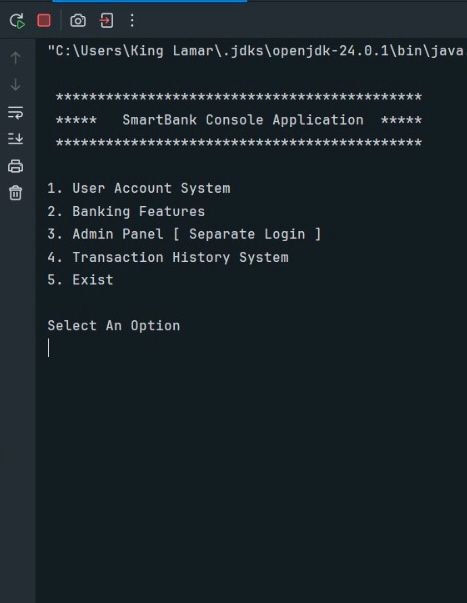

# Demo 📷🖼️:

___

# SmartBank Console Application ❄️⚙️:

### SmartBank Java Application - Quick Overview:

SmartBank is a simple but solid console-based banking system built in Java. It handles the core stuff every digital bank needs such as; **creating accounts**, **storing customer info**, **making deposits** and **withdrawals**, **checking balances**, and **managing user records**.    
The whole app runs through a clean menu-driven interface, so users can navigate easily without getting lost.

---
# Features ❄️🔥:

- **User Account System 🗺️**

- **Banking Features ⚓**

- **Admin Panel [ Separate Login ] 🧮**

- **Transaction Panel ⚙️**

- **Simple And Interactive UI Interface 🏦**.

---

# Tech Stack - Tools Used [ Involved ] 🔥 :

- **Java**

- **OOP**

- **File Handling**

- **Intelli J Idea**

---

# Project Structure 📁♑:

- **SmartBank Console/**

- │── src/

- │   ├── com/

- │   └── bankDatabase/

- │       ├── SmartBank_Console.java

- │       └── User.java
 

---

# How It Works 🔥❄️:

1. **User Account System :**

- Create a new account
   
- Login
 
- Store account details

---

2. **Banking Features ⚓:**

- Deposit money 

- Withdraw money

- Transfer money between accounts

- Check Balance

- View Transaction History

---

3. **Admin Panel [Separate Login] 🏦:**

- View all customers 

- Search customer by name or account number 

- Delete customer 

- Freeze customer account 

---

4. **Transaction History System ❄️🔥:**

- Date

- Time 

- Amount 

- Type Of Transactions [deposit /withdraw /transfer ] 

- Check balance 

- View transaction history 

---

# Setup And Usage:

1. Clone This Repository:

   git clone  https://github.com/Gadogbo-David/SmartBank-Console

2. Navigate to the Project Folder :
   
   cd  SmartBank-Console
---

# Contact Me :

Ghana,Greater Accra

**☎️Whatsapp:**

[Click To Chat](https://wa.me/233501012759)

**✉️Email:**

[codebygad@gmail.com](mailto:codebygad@gmail.com)

**Linkedin:**

[Click To Connect](https://www.linkedin.com/in/david-gadogbo-codebygad-cbg)

---

# Author ⚙️🔥:

**Gadogbo David**   
Aspiring Software Engineer   
AI & Machine Learning Enthusiast
